# plantuml+github
[Chromeをダウンロード](https://www.google.com/chrome/?hl=ja)
```
$ sudo apt install -y ./google-chrome-stable_current_amd64.deb
```
[Pegmatiteのプラグインを追加](https://chrome.google.com/webstore/detail/pegmatite/jegkfbnfbfnohncpcfcimepibmhlkldo)


# 作図メモ

## 概要

```plantuml
@startuml
caption 図●：概要
@enduml
```


